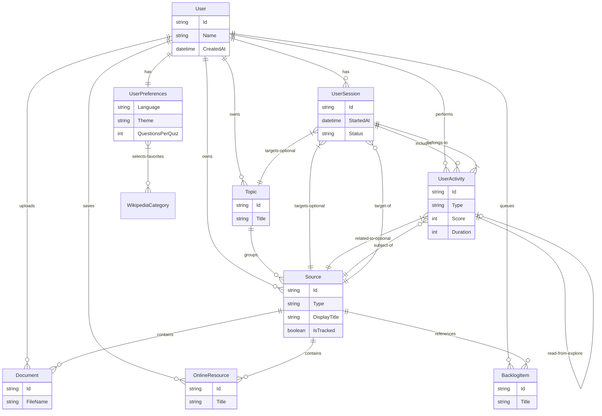

# Derot My Brain - Data Model

```mermaid
erDiagram
    User ||--|| UserPreferences : has
    User ||--o{ UserSession : has
    User ||--o{ UserActivity : performs
    User ||--o{ Topic : owns
    User ||--o{ Source : owns
    User ||--o{ Document : uploads
    User ||--o{ BacklogItem : queues
    User ||--o{ OnlineResource : saves

    Topic ||--o{ Source : groups

    Source ||--o{ Document : contains
    Source ||--o{ OnlineResource : contains
    Source ||--o{ BacklogItem : references
    Source ||--o{ UserActivity : subject-of
    Source ||--o{ UserSession : target-of

    UserSession ||--o{ UserActivity : includes
    UserSession }|--|| Source : targets-optional
    UserSession }|--|| Topic : targets-optional

    UserActivity }|--|| UserSession : belongs-to
    UserActivity }|--|| Source : related-to-optional
    UserActivity ||--o| UserActivity : read-from-explore

    UserPreferences }|--o{ WikipediaCategory : selects-favorites

    User {
        string Id
        string Name
        datetime CreatedAt
    }

    UserPreferences {
        string Language
        string Theme
        int QuestionsPerQuiz
    }

    Topic {
        string Id
        string Title
    }

    Source {
        string Id
        string Type
        string DisplayTitle
        boolean IsTracked
    }

    UserSession {
        string Id
        datetime StartedAt
        string Status
    }

    UserActivity {
        string Id
        string Type
        int Score
        int Duration
    }

    Document {
        string Id
        string FileName
    }

    BacklogItem {
        string Id
        string Title
    }

    OnlineResource {
        string Id
        string Title
    }
```
