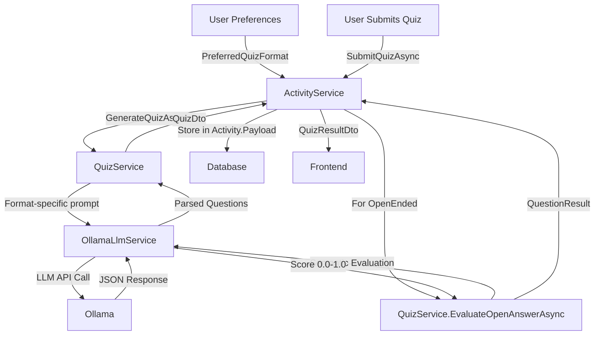

# Mermaid Diagram: Quiz Generation Flow

This diagram illustrates the complete flow of quiz generation in the Derot My Brain application, showing how user preferences (including quiz format) are used to generate and evaluate quizzes.

## Flow Description

### Quiz Generation Phase
1. **User Preferences**: User's `PreferredQuizFormat` setting (MCQ or OpenEnded) is stored in database
2. **ActivityService**: Reads user preference when generating quiz
3. **QuizService**: Orchestrates quiz generation
4. **OllamaLlmService**: Creates format-specific prompts for the LLM
5. **Ollama**: Local LLM generates questions based on content and format
6. **Database**: Generated quiz is stored in `Activity.Payload` as JSON

### Quiz Submission Phase
1. **User Submits**: User answers all questions and submits
2. **ActivityService**: Processes submission
3. **For MCQ**: Simple string comparison (exact match)
4. **For OpenEnded**: 
   - Calls `QuizService.EvaluateOpenAnswerAsync`
   - LLM performs semantic evaluation
   - Returns similarity score (0.0-1.0)
   - Threshold: ≥0.7 = correct
5. **Frontend**: Receives results with scores and explanations

## Related Files

- Backend:
  - [ActivityService.cs](file:///d:/Repos/Derot-my-brain/src/backend/DerotMyBrain.Core/Services/ActivityService.cs)
  - [QuizService.cs](file:///d:/Repos/Derot-my-brain/src/backend/DerotMyBrain.Core/Services/QuizService.cs)
  - [OllamaLlmService.cs](file:///d:/Repos/Derot-my-brain/src/backend/DerotMyBrain.Infrastructure/Services/OllamaLlmService.cs)
  - [UserPreferences.cs](file:///d:/Repos/Derot-my-brain/src/backend/DerotMyBrain.Core/Entities/UserPreferences.cs)

- Frontend:
  - [QuizQuestion.tsx](file:///d:/Repos/Derot-my-brain/src/frontend/src/components/DerotZone/QuizQuestion.tsx)
  - [useQuiz.ts](file:///d:/Repos/Derot-my-brain/src/frontend/src/hooks/useQuiz.ts)
  - [DerotZonePreferencesForm.tsx](file:///d:/Repos/Derot-my-brain/src/frontend/src/components/preferences/DerotZonePreferencesForm.tsx)
