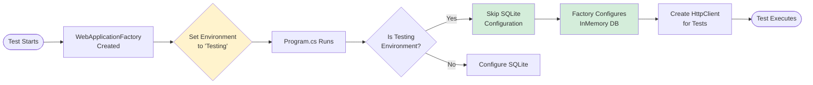

# Testing Infrastructure & Architecture

This document describes the testing infrastructure, technology stack, and architecture used in the Derot My Brain backend project.

## Table of Contents

1. [Technology Stack](#technology-stack)
2. [Test Architecture](#test-architecture)
3. [Test Infrastructure Components](#test-infrastructure-components)
4. [Current Limitations](#current-limitations)
5. [Future Improvements](#future-improvements)

---

## Technology Stack

### Core Testing Frameworks

| Technology | Version | Purpose |
|------------|---------|---------|
| **xUnit** | 2.9.2 | Primary testing framework for .NET |
| **Microsoft.AspNetCore.Mvc.Testing** | 9.0.0 | WebApplicationFactory for integration tests |
| **Microsoft.EntityFrameworkCore.InMemory** | 9.0.0 | In-memory database provider for tests |
| **Moq** | 4.20.72 | Mocking framework (for future unit tests) |
| **coverlet.collector** | 6.0.2 | Code coverage collection |

### Supporting Tools

- **Microsoft.NET.Test.Sdk** (17.12.0) - Test platform
- **xunit.runner.visualstudio** (2.8.2) - Visual Studio test adapter
- **.NET 9.0** - Target framework

---

## Test Architecture

### High-Level Architecture


### Environment Configuration Flow



---

## Test Infrastructure Components

### 1. CustomWebApplicationFactory

**Location:** [`DerotMyBrain.Tests/Integration/CustomWebApplicationFactory.cs`](file:///d:/Repos/Derot-my-brain/src/backend/DerotMyBrain.Tests/Integration/CustomWebApplicationFactory.cs)

**Purpose:** Bootstraps the API application for integration testing with test-specific configuration.

**Key Features:**
- Sets environment to "Testing" to skip production initialization
- Replaces SQLite with EF Core InMemory database
- Uses unique database name per test class instance
- Provides HttpClient for making HTTP requests to API

**Configuration:**
```csharp
services.AddDbContext<DerotDbContext>(options =>
    options.UseInMemoryDatabase("IntegrationTestDb_" + Guid.NewGuid()));
```

---

### 2. DatabaseFixture

**Location:** [`DerotMyBrain.Tests/Fixtures/DatabaseFixture.cs`](file:///d:/Repos/Derot-my-brain/src/backend/DerotMyBrain.Tests/Fixtures/DatabaseFixture.cs)

**Purpose:** Centralized test data management and seeding utilities.

**Key Methods:**
- `SeedDefaultTestDataAsync()` - Seeds default user and 2 activities
- `SeedTestUserAsync()` - Creates test user with preferences
- `SeedTestActivitiesAsync()` - Creates test activities
- `SeedActivityAsync()` - Adds custom activity
- `CleanupAsync()` - Cleanup between tests (optional)
- `GetDbContext()` - Get scoped context for custom scenarios

**Usage Pattern:**
```csharp
private readonly DatabaseFixture _dbFixture;

public async Task InitializeAsync()
{
    await _dbFixture.SeedDefaultTestDataAsync();
}
```

---

### 3. TestDataBuilder

**Location:** [`DerotMyBrain.Tests/Helpers/TestDataBuilder.cs`](file:///d:/Repos/Derot-my-brain/src/backend/DerotMyBrain.Tests/Helpers/TestDataBuilder.cs)

**Purpose:** Fluent builder pattern for creating test entities with sensible defaults.

**Available Builders:**
- `UserBuilder` - Create User entities
- `PreferencesBuilder` - Create UserPreferences entities
- `ActivityBuilder` - Create UserActivity entities

**Example Usage:**
```csharp
// Create a Quiz activity
var activity = new ActivityBuilder()
    .WithId("test-activity-1")
    .WithUserId("test-user")
    .WithTopic("Physics")
    .AsQuiz(lastScore: 8, totalQuestions: 10)
    .Tracked()
    .Build();

await _dbFixture.SeedActivityAsync(activity);
```

---

### 4. Integration Test Structure

**Location:** [`DerotMyBrain.Tests/Integration/ActivitiesControllerIntegrationTests.cs`](file:///d:/Repos/Derot-my-brain/src/backend/DerotMyBrain.Tests/Integration/ActivitiesControllerIntegrationTests.cs)

**Pattern:** Uses `IAsyncLifetime` for proper async initialization and cleanup.

**Key Components:**
```csharp
public class ActivitiesControllerIntegrationTests : 
    IClassFixture<CustomWebApplicationFactory>, 
    IAsyncLifetime
{
    private readonly HttpClient _client;
    private readonly CustomWebApplicationFactory _factory;
    private readonly DatabaseFixture _dbFixture;
    
    // Constructor: Setup factory and client
    public ActivitiesControllerIntegrationTests(CustomWebApplicationFactory factory)
    {
        _factory = factory;
        _client = _factory.CreateClient();
        _dbFixture = new DatabaseFixture(_factory);
    }
    
    // Before each test
    public async Task InitializeAsync()
    {
        await _dbFixture.SeedDefaultTestDataAsync();
    }
    
    // After each test (optional)
    public async Task DisposeAsync()
    {
        await Task.CompletedTask;
    }
}
```

---

## Test Data Flow

### Default Test Data Seeding


### HTTP Request Flow


---


## Future Improvements

### Short-Term

1. **Investigate InMemory DB Persistence**
   - Debug why seeded data isn't visible in HTTP requests
   - Consider switching to SQLite InMemory mode (`Data Source=:memory:`)
   - Alternative: Use shared database with cleanup between tests

2. **Improve Test Isolation**
   - Implement per-test database cleanup
   - Use test-specific data for mutating operations
   - Add test execution order independence verification

3. **Add Unit Tests**
   - Create `Unit/` folder structure
   - Test services in isolation with mocked repositories
   - Test repositories in isolation with test database

### Long-Term

1. **Increase Code Coverage**
   - Target ≥80% coverage for all components
   - Add edge case tests
   - Add error scenario tests

2. **Performance Testing**
   - Ensure tests run quickly (<5 seconds total)
   - Optimize database seeding
   - Consider test parallelization

3. **Documentation**
   - Create testing best practices guide
   - Add examples for common test scenarios
   - Document troubleshooting procedures

---

## Related Documentation

- [Backend-Guidelines.md](file:///d:/Repos/Derot-my-brain/Docs/Technical/Backend-Guidelines.md) - Backend architecture patterns and guidelines
- [Testing-Strategy.md](file:///d:/Repos/Derot-my-brain/Docs/Technical/Testing-Strategy.md) - Overall testing approach and TDD methodology
- [Storage-Policy.md](file:///d:/Repos/Derot-my-brain/Docs/Technical/Storage-Policy.md) - Database choices and storage decisions
- [Implementation Plan](file:///C:/Users/samue/.gemini/antigravity/brain/33811aa8-0c0c-4877-b814-9057395c982f/implementation_plan.md) - Original test infrastructure plan
- [Walkthrough](file:///C:/Users/samue/.gemini/antigravity/brain/33811aa8-0c0c-4877-b814-9057395c982f/walkthrough.md) - Implementation walkthrough and results

---

## Getting Started

### Running Tests

```bash
# Run all tests
dotnet test

# Run with verbosity
dotnet test --verbosity normal

# Run specific test
dotnet test --filter "FullyQualifiedName~GetActivities"

# Run with coverage
dotnet test /p:CollectCoverage=true
```

### Writing New Integration Tests

1. **Add test method to test class**
2. **Use DatabaseFixture for test data**
3. **Use HttpClient for HTTP requests**
4. **Follow AAA pattern** (Arrange-Act-Assert)

**Example:**
```csharp
[Fact]
public async Task GetUser_ShouldReturn200_WhenUserExists()
{
    // Arrange - test data already seeded in InitializeAsync()
    var userId = "test-user-integration";
    
    // Act
    var response = await _client.GetAsync($"/api/users/{userId}");
    
    // Assert
    Assert.Equal(HttpStatusCode.OK, response.StatusCode);
    var user = await response.Content.ReadFromJsonAsync<UserDto>();
    Assert.NotNull(user);
    Assert.Equal(userId, user.Id);
}
```

### Best Practices

1. ✅ **Use DatabaseFixture** for all test data seeding
2. ✅ **Use TestDataBuilder** for creating test entities
3. ✅ **Avoid modifying shared test data** - create dedicated entities instead
4. ✅ **Test one thing per test** - keep tests focused
5. ✅ **Use descriptive test names** - `MethodName_Should[Expected]_When[Condition]`
6. ✅ **Clean up test data** if modifying shared state
7. ❌ **Don't create manual scopes** - use DatabaseFixture methods
8. ❌ **Don't rely on test execution order** - tests should be independent
